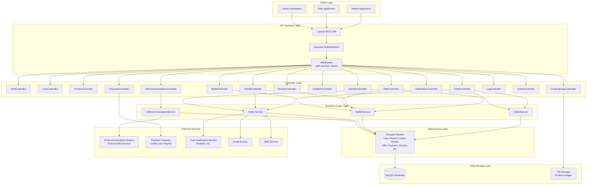

```mermaid
flowchart TB
    subgraph "Client Layer"
        Mobile[Mobile Application]
        Web[Web Application]
        Admin[Admin Dashboard]
    end

    subgraph "API Gateway Layer"
        API[Laravel REST API]
        Auth[Sanctum Authentication]
        MW[Middleware<br/>auth:sanctum, admin]
    end

    subgraph "Controller Layer"
        AuthCtrl[AuthController]
        UserCtrl[UserController]
        ProductCtrl[ProductController]
        OrderCtrl[OrderController]
        RentalCtrl[RentalController]
        OfferCtrl[OfferController]
        PaymentCtrl[PaymentController]
        ReviewCtrl[ReviewController]
        CartCtrl[CartItemController]
        WishlistCtrl[WishlistController]
        WalletCtrl[WalletController]
        NotifyCtrl[NotificationController]
        AICtrl[AiRecommendationController]
        LogCtrl[LogController]
        AdminCtrl[AdminController]
        ImageCtrl[ProductImageController]
    end

    subgraph "Business Logic Layer"
        OrderSvc[OrderService]
        WalletSvc[WalletService]
        NotifySvc[Notify Service]
        AISvc[AIRecommendationService]
    end

    subgraph "Data Access Layer"
        Models[Eloquent Models<br/>User, Product, Order, Rental,<br/>Offer, Payment, Review, etc.]
    end

    subgraph "Data Storage Layer"
        DB[(MySQL Database)]
        Storage[File Storage<br/>Product Images]
    end

    subgraph "External Services"
        AIEngine[AI Recommendation Engine<br/>External Microservice]
        PaymentGW[Payment Gateway<br/>Credit Card, PayPal]
        PushNotify[Push Notification Service<br/>Firebase, etc.]
        EmailSvc[Email Service]
        SMSSvc[SMS Service]
    end

    Mobile --> API
    Web --> API
    Admin --> API

    API --> Auth
    Auth --> MW
    MW --> AuthCtrl
    MW --> UserCtrl
    MW --> ProductCtrl
    MW --> OrderCtrl
    MW --> RentalCtrl
    MW --> OfferCtrl
    MW --> PaymentCtrl
    MW --> ReviewCtrl
    MW --> CartCtrl
    MW --> WishlistCtrl
    MW --> WalletCtrl
    MW --> NotifyCtrl
    MW --> AICtrl
    MW --> LogCtrl
    MW --> AdminCtrl
    MW --> ImageCtrl

    OrderCtrl --> OrderSvc
    OrderCtrl --> WalletSvc
    OrderCtrl --> NotifySvc
    RentalCtrl --> WalletSvc
    RentalCtrl --> NotifySvc
    OfferCtrl --> OrderSvc
    OfferCtrl --> WalletSvc
    OfferCtrl --> NotifySvc
    WalletCtrl --> WalletSvc
    AICtrl --> AISvc

    OrderSvc --> Models
    WalletSvc --> Models
    NotifySvc --> Models
    AISvc --> Models

    Models --> DB
    ImageCtrl --> Storage

    AISvc --> AIEngine
    PaymentCtrl --> PaymentGW
    NotifySvc --> PushNotify
    NotifySvc --> EmailSvc
    NotifySvc --> SMSSvc
```