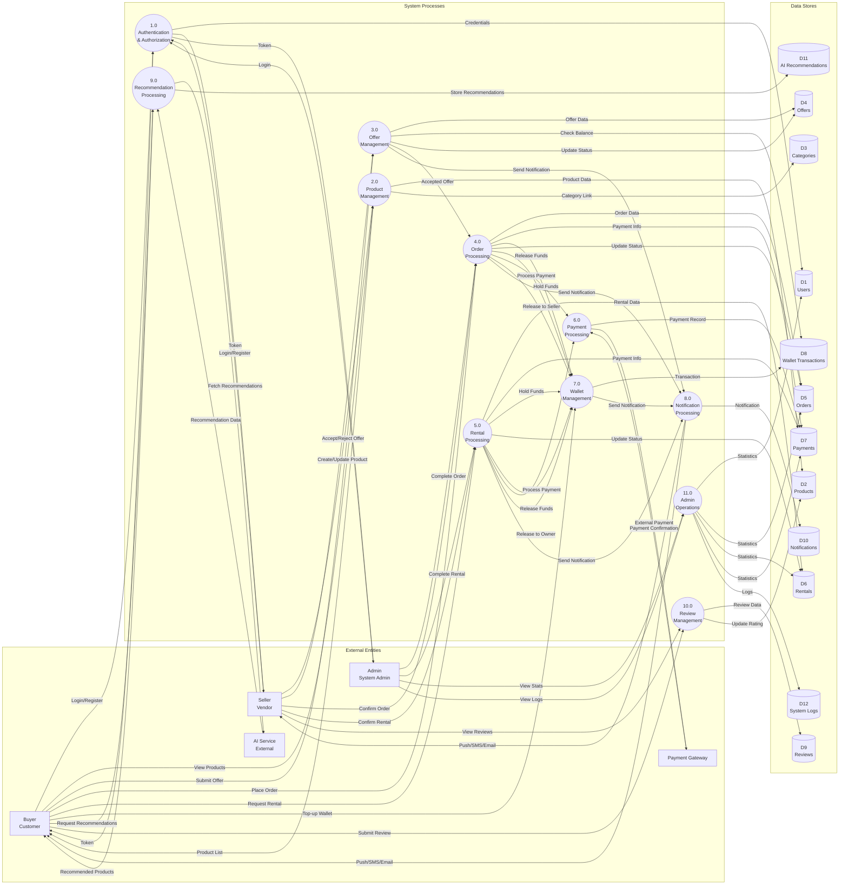

```mermaid
flowchart LR
    subgraph "External Entities"
        Buyer[Buyer<br/>Customer]
        Seller[Seller<br/>Vendor]
        Admin[Admin<br/>System Admin]
        AIEngine[AI Service<br/>External]
        PaymentGW[Payment Gateway]
    end

    subgraph "System Processes"
        Auth((1.0<br/>Authentication<br/>& Authorization))
        ProductMgmt((2.0<br/>Product<br/>Management))
        OfferMgmt((3.0<br/>Offer<br/>Management))
        OrderMgmt((4.0<br/>Order<br/>Processing))
        RentalMgmt((5.0<br/>Rental<br/>Processing))
        PaymentProc((6.0<br/>Payment<br/>Processing))
        WalletMgmt((7.0<br/>Wallet<br/>Management))
        NotifyProc((8.0<br/>Notification<br/>Processing))
        RecommendProc((9.0<br/>Recommendation<br/>Processing))
        ReviewMgmt((10.0<br/>Review<br/>Management))
        AdminOps((11.0<br/>Admin<br/>Operations))
    end

    subgraph "Data Stores"
        UsersDB[(D1<br/>Users)]
        ProductsDB[(D2<br/>Products)]
        CategoriesDB[(D3<br/>Categories)]
        OffersDB[(D4<br/>Offers)]
        OrdersDB[(D5<br/>Orders)]
        RentalsDB[(D6<br/>Rentals)]
        PaymentsDB[(D7<br/>Payments)]
        WalletsDB[(D8<br/>Wallet Transactions)]
        ReviewsDB[(D9<br/>Reviews)]
        NotificationsDB[(D10<br/>Notifications)]
        RecommendationsDB[(D11<br/>AI Recommendations)]
        LogsDB[(D12<br/>System Logs)]
    end

    %% Authentication Flow
    Buyer -->|Login/Register| Auth
    Seller -->|Login/Register| Auth
    Admin -->|Login| Auth
    Auth -->|Credentials| UsersDB
    Auth -->|Token| Buyer
    Auth -->|Token| Seller
    Auth -->|Token| Admin

    %% Product Management
    Seller -->|Create/Update Product| ProductMgmt
    ProductMgmt -->|Product Data| ProductsDB
    ProductMgmt -->|Category Link| CategoriesDB
    Buyer -->|View Products| ProductMgmt
    ProductMgmt -->|Product List| Buyer

    %% Offer Management
    Buyer -->|Submit Offer| OfferMgmt
    OfferMgmt -->|Offer Data| OffersDB
    OfferMgmt -->|Check Balance| WalletsDB
    Seller -->|Accept/Reject Offer| OfferMgmt
    OfferMgmt -->|Update Status| OffersDB

    %% Order Processing
    Buyer -->|Place Order| OrderMgmt
    OfferMgmt -->|Accepted Offer| OrderMgmt
    OrderMgmt -->|Order Data| OrdersDB
    OrderMgmt -->|Payment Info| PaymentsDB
    OrderMgmt -->|Hold Funds| WalletMgmt
    Seller -->|Confirm Order| OrderMgmt
    OrderMgmt -->|Update Status| OrdersDB
    Admin -->|Complete Order| OrderMgmt
    OrderMgmt -->|Release Funds| WalletMgmt

    %% Rental Processing
    Buyer -->|Request Rental| RentalMgmt
    RentalMgmt -->|Rental Data| RentalsDB
    RentalMgmt -->|Payment Info| PaymentsDB
    RentalMgmt -->|Hold Funds| WalletMgmt
    Seller -->|Confirm Rental| RentalMgmt
    RentalMgmt -->|Update Status| RentalsDB
    Admin -->|Complete Rental| RentalMgmt
    RentalMgmt -->|Release Funds| WalletMgmt

    %% Payment Processing
    OrderMgmt -->|Process Payment| PaymentProc
    RentalMgmt -->|Process Payment| PaymentProc
    PaymentProc -->|Payment Record| PaymentsDB
    PaymentProc -->|External Payment| PaymentGW
    PaymentGW -->|Payment Confirmation| PaymentProc

    %% Wallet Management
    WalletMgmt -->|Transaction| WalletsDB
    Buyer -->|Top-up Wallet| WalletMgmt
    OrderMgmt -->|Release to Seller| WalletMgmt
    RentalMgmt -->|Release to Owner| WalletMgmt

    %% Notification Processing
    OrderMgmt -->|Send Notification| NotifyProc
    RentalMgmt -->|Send Notification| NotifyProc
    OfferMgmt -->|Send Notification| NotifyProc
    WalletMgmt -->|Send Notification| NotifyProc
    NotifyProc -->|Notification| NotificationsDB
    NotifyProc -->|Push/SMS/Email| Buyer
    NotifyProc -->|Push/SMS/Email| Seller

    %% Recommendation Processing
    Buyer -->|Request Recommendations| RecommendProc
    RecommendProc -->|Fetch Recommendations| AIEngine
    AIEngine -->|Recommendation Data| RecommendProc
    RecommendProc -->|Store Recommendations| RecommendationsDB
    RecommendProc -->|Recommended Products| Buyer

    %% Review Management
    Buyer -->|Submit Review| ReviewMgmt
    ReviewMgmt -->|Review Data| ReviewsDB
    ReviewMgmt -->|Update Rating| ProductsDB
    Seller -->|View Reviews| ReviewMgmt

    %% Admin Operations
    Admin -->|View Stats| AdminOps
    AdminOps -->|Statistics| UsersDB
    AdminOps -->|Statistics| OrdersDB
    AdminOps -->|Statistics| RentalsDB
    AdminOps -->|Statistics| PaymentsDB
    Admin -->|View Logs| AdminOps
    AdminOps -->|Logs| LogsDB
```