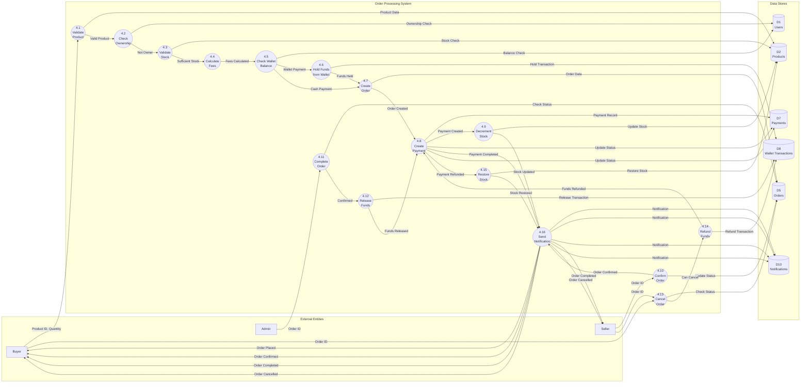

```mermaid
flowchart LR
    subgraph "External Entities"
        Buyer[Buyer]
        Seller[Seller]
        Admin[Admin]
    end

    subgraph "Order Processing System"
        ValidateProduct((4.1<br/>Validate<br/>Product))
        CheckOwnership((4.2<br/>Check<br/>Ownership))
        ValidateStock((4.3<br/>Validate<br/>Stock))
        CalculateFees((4.4<br/>Calculate<br/>Fees))
        CheckWallet((4.5<br/>Check Wallet<br/>Balance))
        HoldFunds((4.6<br/>Hold Funds<br/>from Wallet))
        CreateOrder((4.7<br/>Create<br/>Order))
        CreatePayment((4.8<br/>Create<br/>Payment))
        DecrementStock((4.9<br/>Decrement<br/>Stock))
        ConfirmOrder((4.10<br/>Confirm<br/>Order))
        CompleteOrder((4.11<br/>Complete<br/>Order))
        ReleaseFunds((4.12<br/>Release<br/>Funds))
        CancelOrder((4.13<br/>Cancel<br/>Order))
        RefundFunds((4.14<br/>Refund<br/>Funds))
        RestoreStock((4.15<br/>Restore<br/>Stock))
        SendNotification((4.16<br/>Send<br/>Notification))
    end

    subgraph "Data Stores"
        ProductsDB[(D2<br/>Products)]
        UsersDB[(D1<br/>Users)]
        OrdersDB[(D5<br/>Orders)]
        PaymentsDB[(D7<br/>Payments)]
        WalletsDB[(D8<br/>Wallet Transactions)]
        NotificationsDB[(D10<br/>Notifications)]
    end

    %% Order Creation Flow
    Buyer -->|Product ID, Quantity| ValidateProduct
    ValidateProduct -->|Product Data| ProductsDB
    ValidateProduct -->|Valid Product| CheckOwnership
    CheckOwnership -->|Ownership Check| UsersDB
    CheckOwnership -->|Not Owner| ValidateStock
    ValidateStock -->|Stock Check| ProductsDB
    ValidateStock -->|Sufficient Stock| CalculateFees
    CalculateFees -->|Fees Calculated| CheckWallet
    CheckWallet -->|Balance Check| UsersDB
    
    CheckWallet -->|Wallet Payment| HoldFunds
    HoldFunds -->|Hold Transaction| WalletsDB
    HoldFunds -->|Funds Held| CreateOrder
    
    CheckWallet -->|Cash Payment| CreateOrder
    
    CreateOrder -->|Order Data| OrdersDB
    CreateOrder -->|Order Created| CreatePayment
    CreatePayment -->|Payment Record| PaymentsDB
    CreatePayment -->|Payment Created| DecrementStock
    DecrementStock -->|Update Stock| ProductsDB
    DecrementStock -->|Stock Updated| SendNotification
    SendNotification -->|Notification| NotificationsDB
    SendNotification -->|Order Placed| Buyer

    %% Order Confirmation Flow
    Seller -->|Order ID| ConfirmOrder
    ConfirmOrder -->|Update Status| OrdersDB
    ConfirmOrder -->|Order Confirmed| SendNotification
    SendNotification -->|Notification| NotificationsDB
    SendNotification -->|Order Confirmed| Buyer

    %% Order Completion Flow
    Admin -->|Order ID| CompleteOrder
    CompleteOrder -->|Check Status| OrdersDB
    CompleteOrder -->|Confirmed| ReleaseFunds
    ReleaseFunds -->|Release Transaction| WalletsDB
    ReleaseFunds -->|Funds Released| CreatePayment
    CreatePayment -->|Update Status| PaymentsDB
    CreatePayment -->|Payment Completed| SendNotification
    SendNotification -->|Notification| NotificationsDB
    SendNotification -->|Order Completed| Seller
    SendNotification -->|Order Completed| Buyer

    %% Order Cancellation Flow
    Buyer -->|Order ID| CancelOrder
    Seller -->|Order ID| CancelOrder
    CancelOrder -->|Check Status| OrdersDB
    CancelOrder -->|Can Cancel| RefundFunds
    RefundFunds -->|Refund Transaction| WalletsDB
    RefundFunds -->|Funds Refunded| CreatePayment
    CreatePayment -->|Update Status| PaymentsDB
    CreatePayment -->|Payment Refunded| RestoreStock
    RestoreStock -->|Restore Stock| ProductsDB
    RestoreStock -->|Stock Restored| SendNotification
    SendNotification -->|Notification| NotificationsDB
    SendNotification -->|Order Cancelled| Buyer
    SendNotification -->|Order Cancelled| Seller
```