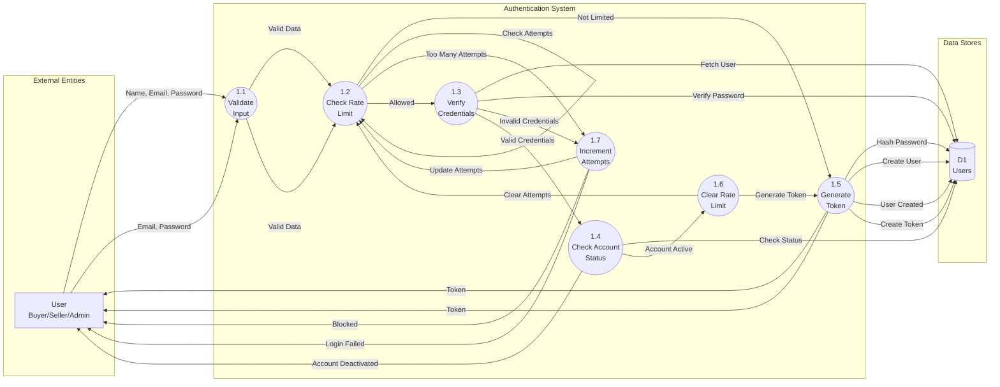

```mermaid
flowchart LR
    subgraph "External Entities"
        User[User<br/>Buyer/Seller/Admin]
    end

    subgraph "Authentication System"
        ValidateInput((1.1<br/>Validate<br/>Input))
        CheckRateLimit((1.2<br/>Check Rate<br/>Limit))
        VerifyCredentials((1.3<br/>Verify<br/>Credentials))
        CheckAccountStatus((1.4<br/>Check Account<br/>Status))
        GenerateToken((1.5<br/>Generate<br/>Token))
        ClearRateLimit((1.6<br/>Clear Rate<br/>Limit))
        IncrementAttempts((1.7<br/>Increment<br/>Attempts))
    end

    subgraph "Data Stores"
        UsersDB[(D1<br/>Users)]
    end

    %% Registration Flow
    User -->|Name, Email, Password| ValidateInput
    ValidateInput -->|Valid Data| CheckRateLimit
    CheckRateLimit -->|Not Limited| GenerateToken
    GenerateToken -->|Hash Password| UsersDB
    GenerateToken -->|Create User| UsersDB
    GenerateToken -->|User Created| UsersDB
    GenerateToken -->|Token| User

    %% Login Flow
    User -->|Email, Password| ValidateInput
    ValidateInput -->|Valid Data| CheckRateLimit
    CheckRateLimit -->|Check Attempts| CheckRateLimit
    
    CheckRateLimit -->|Too Many Attempts| IncrementAttempts
    IncrementAttempts -->|Blocked| User
    
    CheckRateLimit -->|Allowed| VerifyCredentials
    VerifyCredentials -->|Fetch User| UsersDB
    VerifyCredentials -->|Verify Password| UsersDB
    
    VerifyCredentials -->|Invalid Credentials| IncrementAttempts
    IncrementAttempts -->|Update Attempts| CheckRateLimit
    IncrementAttempts -->|Login Failed| User
    
    VerifyCredentials -->|Valid Credentials| CheckAccountStatus
    CheckAccountStatus -->|Check Status| UsersDB
    
    CheckAccountStatus -->|Account Deactivated| User
    CheckAccountStatus -->|Account Active| ClearRateLimit
    ClearRateLimit -->|Clear Attempts| CheckRateLimit
    ClearRateLimit -->|Generate Token| GenerateToken
    GenerateToken -->|Create Token| UsersDB
    GenerateToken -->|Token| User
```