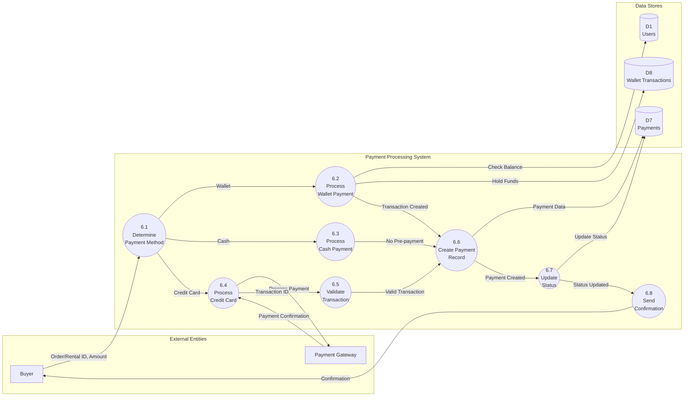

```mermaid

flowchart LR
    subgraph "External Entities"
        Buyer[Buyer]
        PaymentGW[Payment Gateway]
    end

    subgraph "Payment Processing System"
        DetermineMethod((6.1<br/>Determine<br/>Payment Method))
        WalletPayment((6.2<br/>Process<br/>Wallet Payment))
        CashPayment((6.3<br/>Process<br/>Cash Payment))
        CreditCardPayment((6.4<br/>Process<br/>Credit Card))
        ValidateTransaction((6.5<br/>Validate<br/>Transaction))
        CreatePaymentRecord((6.6<br/>Create Payment<br/>Record))
        UpdateStatus((6.7<br/>Update<br/>Status))
        SendConfirmation((6.8<br/>Send<br/>Confirmation))
    end

    subgraph "Data Stores"
        PaymentsDB[(D7<br/>Payments)]
        WalletsDB[(D8<br/>Wallet Transactions)]
        UsersDB[(D1<br/>Users)]
    end

    %% Payment Initiation
    Buyer -->|Order/Rental ID, Amount| DetermineMethod
    
    %% Wallet Payment Flow
    DetermineMethod -->|Wallet| WalletPayment
    WalletPayment -->|Check Balance| UsersDB
    WalletPayment -->|Hold Funds| WalletsDB
    WalletPayment -->|Transaction Created| CreatePaymentRecord
    
    %% Cash Payment Flow
    DetermineMethod -->|Cash| CashPayment
    CashPayment -->|No Pre-payment| CreatePaymentRecord
    
    %% Credit Card Payment Flow
    DetermineMethod -->|Credit Card| CreditCardPayment
    CreditCardPayment -->|Process Payment| PaymentGW
    PaymentGW -->|Payment Confirmation| CreditCardPayment
    CreditCardPayment -->|Transaction ID| ValidateTransaction
    
    %% Common Flow
    ValidateTransaction -->|Valid Transaction| CreatePaymentRecord
    CreatePaymentRecord -->|Payment Data| PaymentsDB
    CreatePaymentRecord -->|Payment Created| UpdateStatus
    
    UpdateStatus -->|Update Status| PaymentsDB
    UpdateStatus -->|Status Updated| SendConfirmation
    SendConfirmation -->|Confirmation| Buyer
```