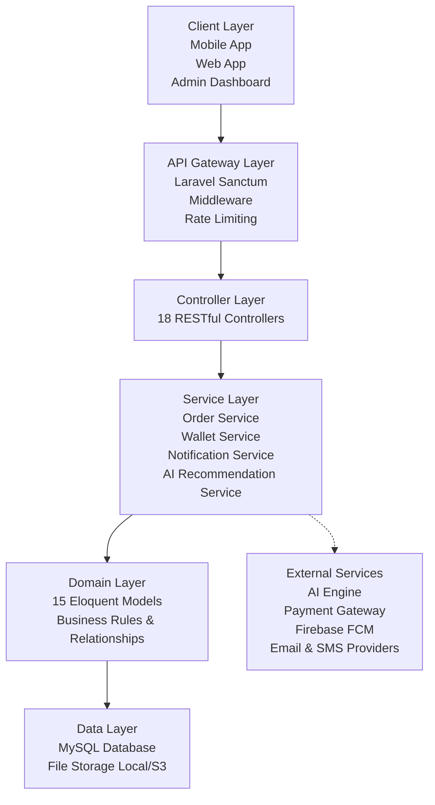

---

### Folder: `Block Diagram/`

#### Folder Analysis

| Aspect | Details |
|--------|---------|
| **Purpose** | Contains system architecture diagrams, block diagrams, DFDs, and data flow analysis |
| **Information Extracted** | Complete architecture overview, 7-layer architecture, 3 mermaid block diagrams, DFD Level 0 & 1, detailed data flow analysis for 6 flows (Auth, Product, Offer, Order, Payment, Notification), external integrations (AI, Payment, Notification) |
| **Current Status** | Has `Block_Diagram.md` with mermaid diagrams and text descriptions |
| **Missing Information** | README.md to navigate and explain the diagrams |

#### Suggested README Content

```markdown
# Block Diagram & System Architecture

This folder contains the complete architectural documentation for the Tasleem platform, including block diagrams, data flow diagrams (DFD), and detailed data flow analysis.

---

## Contents

| File | Description |
|------|-------------|
| [`Block_Diagram.md`](Block_Diagram.md) | Complete architecture documentation with mermaid diagrams |
| `Block_Diagram.png` | High-level block diagram (static image) |
| `Block_Diagram.svg` | High-level block diagram (vector format) |
| `Block_Diagram_HD.svg` | High-resolution block diagram |
| `Data_Flow_Diagram_(DFD Level 0).md` | DFD Level 0 — system context diagram |
| `Data_Flow_Diagram_(DFD Level 0).svg` | DFD Level 0 visualization |
| `Data_Flow_Diagram_(DFD Level 1).md` | DFD Level 1 — detailed processes |
| `Data_Flow_Diagram_(DFD Level 1).svg` | DFD Level 1 visualization |
| `Process_4.0_Order_Processing_(Detailed).md` | Detailed order processing flow |
| `Process_4.0_Order_Processing_(Detailed).svg` | Order processing diagram |
| `Process_6.0_Payment_Processing.md` | Detailed payment processing flow |
| `Process_6.0_Payment_Processing.svg` | Payment processing diagram |
| `System_Architecture_Diagram.md` | Layered system architecture description |
| `System_Architecture_Diagram_HD.svg` | System architecture visualization |

---

## Architecture Overview

The Tasleem platform is designed as a **RESTful API Architecture** with a clear **Layered Architecture** using the Laravel Framework. It follows the **Service Layer Pattern** to separate business logic from controllers.

### Key Architectural Features

| Feature | Implementation |
|---------|---------------|
| **API-First Design** | Entire system exposed as RESTful API |
| **Token-Based Authentication** | Laravel Sanctum |
| **Service Layer** | Business logic isolated in dedicated Services |
| **Microservice Integration** | External AI Recommendation Engine via REST API |
| **Escrow Payment System** | Wallet-based payment with fund holding mechanism |
| **Audit Logging** | Comprehensive system-wide activity tracking |

---

## Seven-Layer Architecture

## System Architecture

Tasleem follows a **Layered RESTful Architecture** that ensures scalability, maintainability, and separation of concerns across all system components.



### Architectural Layers

| Layer                 | Responsibility                                                                                             |
| --------------------- | ---------------------------------------------------------------------------------------------------------- |
| **Client Layer**      | Provides user interfaces through mobile, web, and administration applications.                             |
| **API Gateway Layer** | Handles authentication, authorization, request validation, and rate limiting.                              |
| **Controller Layer**  | Exposes RESTful endpoints and coordinates incoming requests.                                               |
| **Service Layer**     | Implements business logic, transaction handling, notifications, and AI integrations.                       |
| **Domain Layer**      | Represents business entities using Eloquent models and manages relationships.                              |
| **Data Layer**        | Stores application data, uploaded files, and transactional records.                                        |
| **External Services** | Integrates with AI recommendation engines, payment providers, notification services, and third-party APIs. |

```
```


---

## Data Flow Diagrams

### DFD Level 0 — System Context

The Level 0 DFD illustrates the overall data flow between external entities and the main system:

**External Entities:** Buyer, Seller, Admin, AI Service, Payment Gateway

**System Processes:**
- 1.0 Authentication & Authorization
- 2.0 Product Management
- 3.0 Offer Management
- 4.0 Order Processing
- 5.0 Rental Processing
- 6.0 Payment Processing
- 7.0 Wallet Management
- 8.0 Notification Processing
- 9.0 Recommendation Processing
- 10.0 Review Management
- 11.0 Admin Operations

**Data Stores:** D1 (Users), D2 (Products), D3 (Categories), D4 (Offers), D5 (Orders), D6 (Rentals), D7 (Payments), D8 (Wallet), D9 (Reviews), D10 (Notifications), D11 (AI Recommendations), D12 (Logs)

### DFD Level 1 — Detailed Processes

Level 1 DFDs provide detailed breakdowns of critical processes:

| Process | Description | Details |
|---------|-------------|---------|
| **1.0 Authentication** | User login/registration with rate limiting | [View diagram](Data_Flow_Diagram_(DFD%20Level%201).svg) |
| **4.0 Order Processing** | Complete order lifecycle | [View detailed diagram](Process_4.0_Order_Processing_(Detailed).svg) |
| **6.0 Payment Processing** | Multi-method payment handling | [View detailed diagram](Process_6.0_Payment_Processing.svg) |

---

## Data Flow Analysis

### Authentication Flow

| Stage | Details |
|-------|---------|
| **Input** | Email, Password, Name, Phone, National ID |
| **Processing** | 1. Validate input → 2. Check rate limit (5/min) → 3. Verify credentials → 4. Check account status → 5. Generate Sanctum token → 6. Clear rate limit |
| **Output** | Bearer token, User data (ID, name, email, role, wallet_balance) |

### Product Flow

| Stage | Details |
|-------|---------|
| **Input** | Product name, description, price, category, quantity, type, images |
| **Processing** | Validate → Check category → Verify owner → Upload images → Create record → Log action |
| **Output** | Product object with ID, image URLs, category details, owner details |

### Offer Flow

| Stage | Details |
|-------|---------|
| **Input** | Product ID, offer amount, payment method (wallet/cash) |
| **Processing** | Validate product → Check ownership → Verify wallet balance (if wallet) → Create offer → Notify seller |
| **Output** | Offer object with pending status, seller notification |

### Order Flow

| Stage | Details |
|-------|---------|
| **Input** | Product ID, quantity, payment method, or Offer ID |
| **Processing** | Validate availability → Check ownership → Calculate fees → Hold wallet funds → Create order → Create payment → Decrement stock → Notify seller |
| **Output** | Order object, payment record, updated stock, notifications |

### Payment Flow

| Stage | Details |
|-------|---------|
| **Input** | Order/Rental ID, amount, payment method |
| **Processing** | Determine method → Wallet: verify & hold → Cash: no prepayment → Credit Card: process via gateway → Create record → Update status |
| **Output** | Payment record, transaction ID, confirmation |

### Notification Flow

| Stage | Details |
|-------|---------|
| **Input** | User ID, notification type, title, body, reference type, reference ID |
| **Processing** | Create record → Determine delivery method → Send via channel → Log delivery |
| **Output** | Notification record, delivery confirmation |

---

## External Integrations

### AI Recommendation Service

| Aspect | Details |
|--------|---------|
| **Type** | REST API (External Microservice) |
| **Architecture** | Laravel API → AIRecommendationService → AI Engine (Python/ML) → ai_recommendations table (Cache) |
| **Algorithms** | Collaborative, Content, Hybrid, Popularity, Location-based |
| **Key Feature** | Recommendations have `expires_at` for periodic refresh |

### Payment Gateway

| Aspect | Details |
|--------|---------|
| **Type** | REST API (External Service) |
| **Methods** | Credit Card (Stripe/PayPal), PayPal, Bank Transfer, Cash on Delivery, Wallet (internal) |
| **Tracking** | Transaction IDs, status: pending/completed/failed/refunded |

### Notification Service

| Aspect | Details |
|--------|---------|
| **Channels** | Push (Firebase FCM), Email (SendGrid/Mailgun), SMS (Twilio), In-app (database) |
| **Features** | Polymorphic references (ref_type, ref_id), read/unread tracking |

---

## Diagram Files

> **Note:** SVG diagrams are best viewed in browsers or markdown renderers that support mermaid. PNG files are provided for universal compatibility.

| Diagram | PNG | SVG |
|---------|-----|-----|
| Block Diagram | `Block_Diagram.png` | `Block_Diagram.svg` |
| System Architecture | — | `System_Architecture_Diagram_HD.svg` |
| DFD Level 0 | — | `Data_Flow_Diagram_(DFD Level 0).svg` |
| DFD Level 1 | — | `Data_Flow_Diagram_(DFD Level 1).svg` |
| Order Processing (4.0) | — | `Process_4.0_Order_Processing_(Detailed).svg` |
| Payment Processing (6.0) | — | `Process_6.0_Payment_Processing.svg` |

---

*For the complete mermaid source code of all diagrams, see [Block_Diagram.md](Block_Diagram.md)*