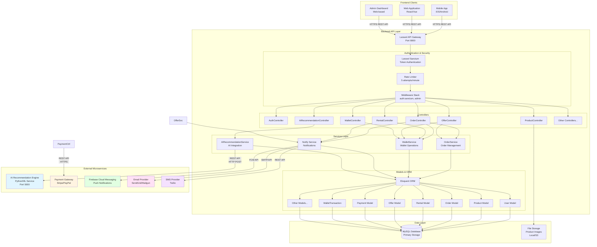

```mermaid
flowchart TB
    subgraph "Frontend Clients"
        MobileApp[Mobile App<br/>iOS/Android]
        WebApp[Web Application<br/>React/Vue]
        AdminPanel[Admin Dashboard<br/>Web-based]
    end

    subgraph "Backend API Layer"
        direction TB
        APIGateway[Laravel API Gateway<br/>Port 8000]
        
        subgraph "Authentication & Security"
            Sanctum[Laravel Sanctum<br/>Token Authentication]
            RateLimiter[Rate Limiter<br/>5 attempts/minute]
            Middleware[Middleware Stack<br/>auth:sanctum, admin]
        end

        subgraph "Controllers"
            AuthCtrl[AuthController]
            ProductCtrl[ProductController]
            OrderCtrl[OrderController]
            RentalCtrl[RentalController]
            OfferCtrl[OfferController]
            WalletCtrl[WalletController]
            AICtrl[AiRecommendationController]
            OtherCtrl[Other Controllers...]
        end

        subgraph "Services Layer"
            OrderSvc[OrderService<br/>Order Management]
            WalletSvc[WalletService<br/>Wallet Operations]
            NotifySvc[Notify Service<br/>Notifications]
            AISvc[AIRecommendationService<br/>AI Integration]
        end

        subgraph "Models & ORM"
            Eloquent[Eloquent ORM]
            User[User Model]
            Product[Product Model]
            Order[Order Model]
            Rental[Rental Model]
            Offer[Offer Model]
            Payment[Payment Model]
            Wallet[WalletTransaction]
            OtherModels[Other Models...]
        end
    end

    subgraph "Data Layer"
        MySQL[(MySQL Database<br/>Primary Storage)]
        FileStorage[File Storage<br/>Product Images<br/>Local/S3]
    end

    subgraph "External Microservices"
        AIEngine[AI Recommendation Engine<br/>Python/ML Service<br/>Port 5000]
        PaymentGW[Payment Gateway<br/>Stripe/PayPal]
        Firebase[Firebase Cloud Messaging<br/>Push Notifications]
        EmailProvider[Email Provider<br/>SendGrid/Mailgun]
        SMSProvider[SMS Provider<br/>Twilio]
    end

    MobileApp -->|HTTPS REST API| APIGateway
    WebApp -->|HTTPS REST API| APIGateway
    AdminPanel -->|HTTPS REST API| APIGateway

    APIGateway --> Sanctum
    Sanctum --> RateLimiter
    RateLimiter --> Middleware

    Middleware --> AuthCtrl
    Middleware --> ProductCtrl
    Middleware --> OrderCtrl
    Middleware --> RentalCtrl
    Middleware --> OfferCtrl
    Middleware --> WalletCtrl
    Middleware --> AICtrl
    Middleware --> OtherCtrl

    OrderCtrl --> OrderSvc
    OrderCtrl --> WalletSvc
    OrderCtrl --> NotifySvc
    RentalCtrl --> WalletSvc
    RentalCtrl --> NotifySvc
    OfferCtrl --> OrderSvc
    OfferCtrl --> WalletSvc
    OfferSvc --> NotifySvc
    WalletCtrl --> WalletSvc
    AICtrl --> AISvc

    OrderSvc --> Eloquent
    WalletSvc --> Eloquent
    NotifySvc --> Eloquent
    AISvc --> Eloquent

    Eloquent --> User
    Eloquent --> Product
    Eloquent --> Order
    Eloquent --> Rental
    Eloquent --> Offer
    Eloquent --> Payment
    Eloquent --> Wallet
    Eloquent --> OtherModels

    User --> MySQL
    Product --> MySQL
    Order --> MySQL
    Rental --> MySQL
    Offer --> MySQL
    Payment --> MySQL
    Wallet --> MySQL
    OtherModels --> MySQL

    ProductCtrl --> FileStorage

    AISvc -->|REST API<br/>HTTP POST| AIEngine
    PaymentCtrl -->|REST API<br/>HTTPS| PaymentGW
    NotifySvc -->|FCM API| Firebase
    NotifySvc -->|SMTP/API| EmailProvider
    NotifySvc -->|REST API| SMSProvider

    style AIEngine fill:#e1f5ff
    style PaymentGW fill:#fff4e1
    style Firebase fill:#e1ffe1
    style EmailProvider fill:#ffe1f5
    style SMSProvider fill:#f5e1ff
```