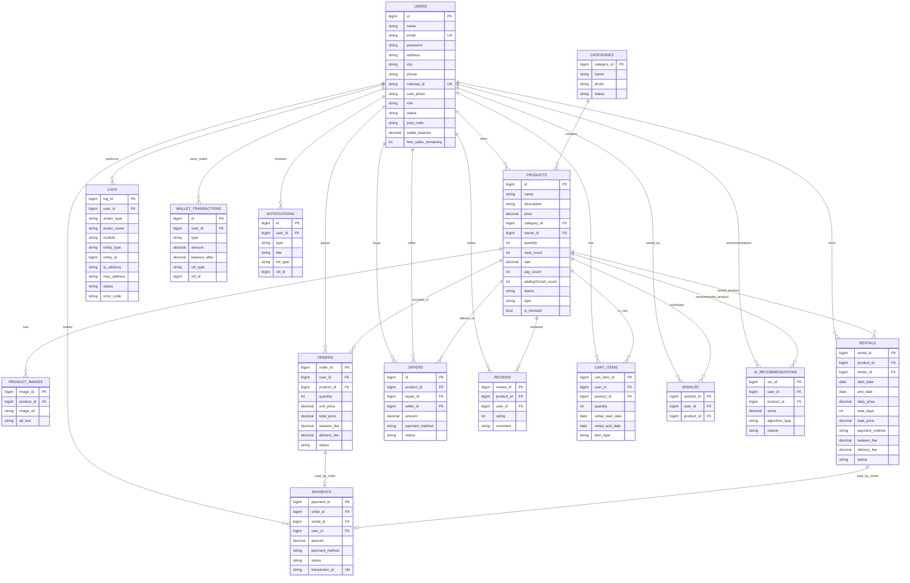

```mermaid
erDiagram

    USERS {
        bigint id PK
        string name
        string email UK
        string password
        string address
        string city
        string phone
        string national_id UK
        string user_photo
        string role
        string status
        string post_code
        decimal wallet_balance
        int free_sales_remaining
    }

    CATEGORIES {
        bigint category_id PK
        string name
        string photo
        string status
    }

    PRODUCTS {
        bigint id PK
        string name
        string description
        decimal price
        bigint category_id FK
        bigint owner_id FK
        int quantity
        int view_count
        decimal rate
        int pay_count
        int addingToCart_count
        string status
        string type
        bool is_boosted
    }

    PRODUCT_IMAGES {
        bigint image_id PK
        bigint product_id FK
        string image_url
        string alt_text
    }

    ORDERS {
        bigint order_id PK
        bigint user_id FK
        bigint product_id FK
        int quantity
        decimal unit_price
        decimal total_price
        decimal tasleem_fee
        decimal delivery_fee
        string status
    }

    RENTALS {
        bigint rental_id PK
        bigint product_id FK
        bigint renter_id FK
        date start_date
        date end_date
        decimal daily_price
        int total_days
        decimal total_price
        string payment_method
        decimal tasleem_fee
        decimal delivery_fee
        string status
    }

    OFFERS {
        bigint id PK
        bigint product_id FK
        bigint buyer_id FK
        bigint seller_id FK
        decimal amount
        string payment_method
        string status
    }

    PAYMENTS {
        bigint payment_id PK
        bigint order_id FK
        bigint rental_id FK
        bigint user_id FK
        decimal amount
        string payment_method
        string status
        string transaction_id UK
    }

    REVIEWS {
        bigint review_id PK
        bigint product_id FK
        bigint user_id FK
        int rating
        string comment
    }

    CART_ITEMS {
        bigint cart_item_id PK
        bigint user_id FK
        bigint product_id FK
        int quantity
        date rental_start_date
        date rental_end_date
        string item_type
    }

    WISHLIST {
        bigint wishlist_id PK
        bigint user_id FK
        bigint product_id FK
    }

    AI_RECOMMENDATIONS {
        bigint rec_id PK
        bigint user_id FK
        bigint product_id FK
        decimal score
        string algorithm_type
        string reason
    }

    LOGS {
        bigint log_id PK
        bigint user_id FK
        string action_type
        string action_name
        string module
        string entity_type
        bigint entity_id
        string ip_address
        string mac_address
        string status
        string error_code
    }

    WALLET_TRANSACTIONS {
        bigint id PK
        bigint user_id FK
        string type
        decimal amount
        decimal balance_after
        string ref_type
        bigint ref_id
    }

    NOTIFICATIONS {
        bigint id PK
        bigint user_id FK
        string type
        string title
        string ref_type
        bigint ref_id
    }

    USERS ||--o{ PRODUCTS : owns
    CATEGORIES ||--o{ PRODUCTS : contains
    PRODUCTS ||--o{ PRODUCT_IMAGES : has
    USERS ||--o{ ORDERS : places
    PRODUCTS ||--o{ ORDERS : included_in
    USERS ||--o{ RENTALS : rents
    PRODUCTS ||--o{ RENTALS : rented_product
    USERS ||--o{ REVIEWS : writes
    PRODUCTS ||--o{ REVIEWS : reviewed
    USERS ||--o{ CART_ITEMS : has
    PRODUCTS ||--o{ CART_ITEMS : in_cart
    USERS ||--o{ WISHLIST : saved_by
    PRODUCTS ||--o{ WISHLIST : wishlisted
    USERS ||--o{ PAYMENTS : makes
    ORDERS ||--o| PAYMENTS : paid_by_order
    RENTALS ||--o| PAYMENTS : paid_by_rental
    USERS ||--o{ OFFERS : buyer
    USERS ||--o{ OFFERS : seller
    PRODUCTS ||--o{ OFFERS : offered_on
    USERS ||--o{ AI_RECOMMENDATIONS : recommendations
    PRODUCTS ||--o{ AI_RECOMMENDATIONS : recommended_product
    USERS ||--o{ LOGS : performs
    USERS ||--o{ WALLET_TRANSACTIONS : owns_wallet
    USERS ||--o{ NOTIFICATIONS : receives
```
