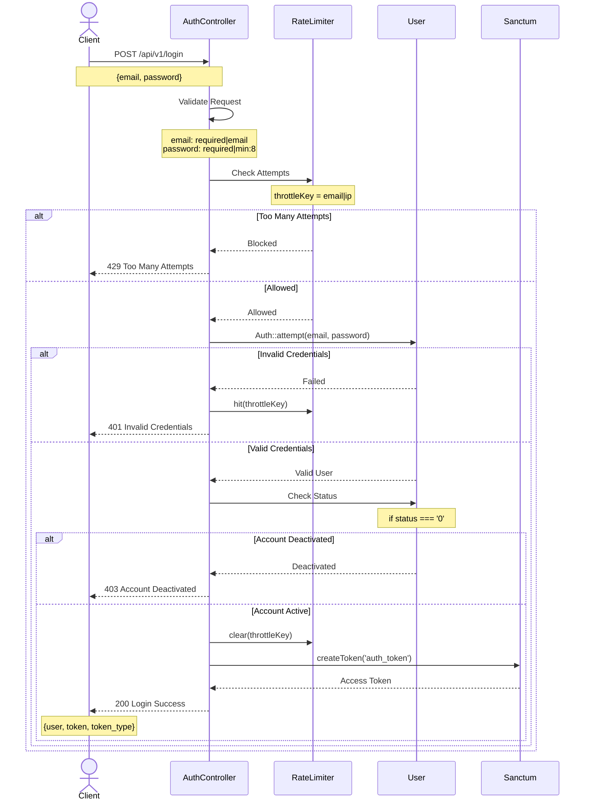

# Scenario 1: User Login with Rate Limiting

```mermaid
sequenceDiagram
    actor Client
    participant AuthController
    participant RateLimiter
    participant User
    participant Sanctum

    Client->>AuthController: POST /api/v1/login
    Note over Client,AuthController: {email, password}

    AuthController->>AuthController: Validate Request
    Note over AuthController: email: required|email<br/>password: required|min:8

    AuthController->>RateLimiter: Check Attempts
    Note over RateLimiter: throttleKey = email|ip

    alt Too Many Attempts
        RateLimiter-->>AuthController: Blocked
        AuthController-->>Client: 429 Too Many Attempts
    else Allowed
        RateLimiter-->>AuthController: Allowed

        AuthController->>User: Auth::attempt(email, password)
        
        alt Invalid Credentials
            User-->>AuthController: Failed
            AuthController->>RateLimiter: hit(throttleKey)
            AuthController-->>Client: 401 Invalid Credentials
        else Valid Credentials
            User-->>AuthController: Valid User

            AuthController->>User: Check Status
            Note over User: if status === '0'

            alt Account Deactivated
                User-->>AuthController: Deactivated
                AuthController-->>Client: 403 Account Deactivated
            else Account Active
                AuthController->>RateLimiter: clear(throttleKey)
                AuthController->>Sanctum: createToken('auth_token')
                Sanctum-->>AuthController: Access Token
                AuthController-->>Client: 200 Login Success
                Note over Client: {user, token, token_type}
            end
        end
    end
```    