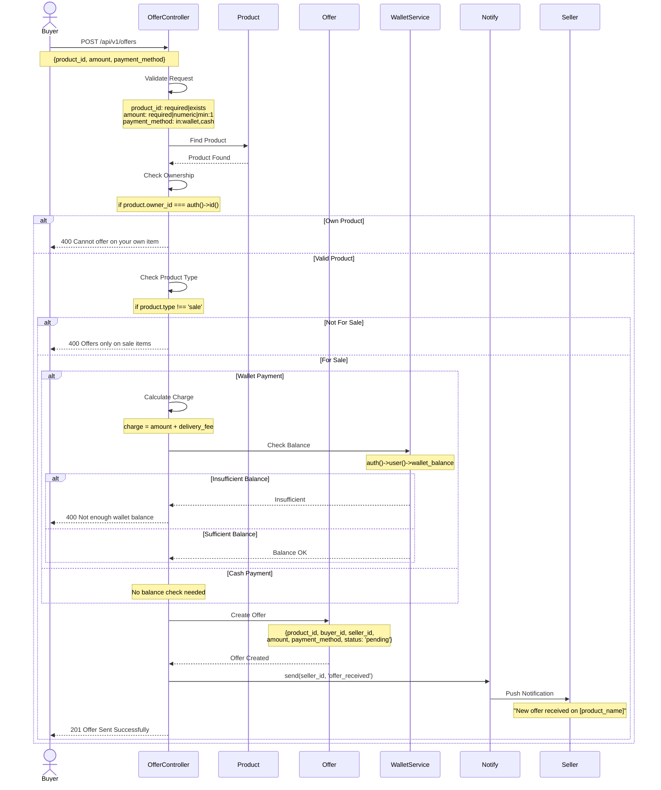

# Scenario 2: Submit Offer with Balance Check

```mermaid
sequenceDiagram
    actor Buyer
    participant OfferController
    participant Product
    participant Offer
    participant WalletService
    participant Notify
    participant Seller

    Buyer->>OfferController: POST /api/v1/offers
    Note over Buyer,OfferController: {product_id, amount, payment_method}

    OfferController->>OfferController: Validate Request
    Note over OfferController: product_id: required|exists<br/>amount: required|numeric|min:1<br/>payment_method: in:wallet,cash

    OfferController->>Product: Find Product
    Product-->>OfferController: Product Found

    OfferController->>OfferController: Check Ownership
    Note over OfferController: if product.owner_id === auth()->id()

    alt Own Product
        OfferController-->>Buyer: 400 Cannot offer on your own item
    else Valid Product
        OfferController->>OfferController: Check Product Type
        Note over OfferController: if product.type !== 'sale'

        alt Not For Sale
            OfferController-->>Buyer: 400 Offers only on sale items
        else For Sale
            alt Wallet Payment
                OfferController->>OfferController: Calculate Charge
                Note over OfferController: charge = amount + delivery_fee

                OfferController->>WalletService: Check Balance
                Note over WalletService: auth()->user()->wallet_balance

                alt Insufficient Balance
                    WalletService-->>OfferController: Insufficient
                    OfferController-->>Buyer: 400 Not enough wallet balance
                else Sufficient Balance
                    WalletService-->>OfferController: Balance OK
                end
            else Cash Payment
                Note over OfferController: No balance check needed
            end

            OfferController->>Offer: Create Offer
            Note over Offer: {product_id, buyer_id, seller_id,<br/>amount, payment_method, status: 'pending'}
            Offer-->>OfferController: Offer Created

            OfferController->>Notify: send(seller_id, 'offer_received')
            Notify->>Seller: Push Notification
            Note over Seller: "New offer received on [product_name]"

            OfferController-->>Buyer: 201 Offer Sent Successfully
        end
    end
```    