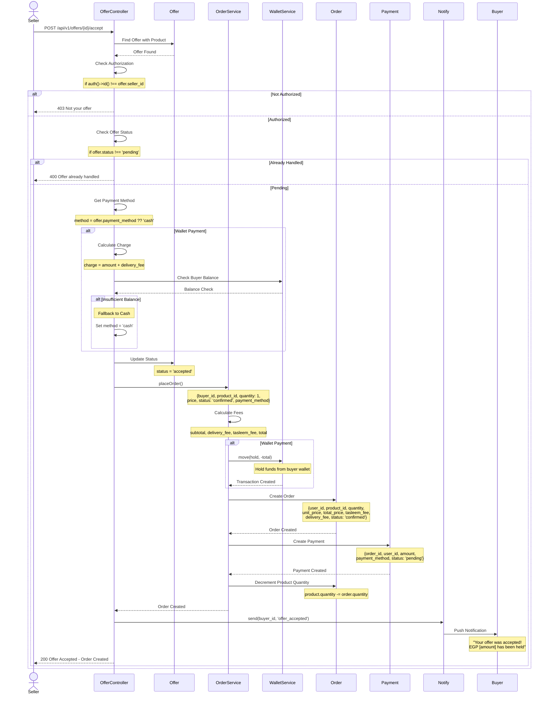

# Scenario 3: Accept Offer & Create Order

```mermaid
sequenceDiagram
    actor Seller
    participant OfferController
    participant Offer
    participant OrderService
    participant WalletService
    participant Order
    participant Payment
    participant Notify
    participant Buyer

    Seller->>OfferController: POST /api/v1/offers/{id}/accept

    OfferController->>Offer: Find Offer with Product
    Offer-->>OfferController: Offer Found

    OfferController->>OfferController: Check Authorization
    Note over OfferController: if auth()->id() !== offer.seller_id

    alt Not Authorized
        OfferController-->>Seller: 403 Not your offer
    else Authorized
        OfferController->>OfferController: Check Offer Status
        Note over OfferController: if offer.status !== 'pending'

        alt Already Handled
            OfferController-->>Seller: 400 Offer already handled
        else Pending
            OfferController->>OfferController: Get Payment Method
            Note over OfferController: method = offer.payment_method ?? 'cash'

            alt Wallet Payment
                OfferController->>OfferController: Calculate Charge
                Note over OfferController: charge = amount + delivery_fee

                OfferController->>WalletService: Check Buyer Balance
                WalletService-->>OfferController: Balance Check

                alt Insufficient Balance
                    Note over OfferController: Fallback to Cash
                    OfferController->>OfferController: Set method = 'cash'
                end
            end

            OfferController->>Offer: Update Status
            Note over Offer: status = 'accepted'

            OfferController->>OrderService: placeOrder()
            Note over OrderService: {buyer_id, product_id, quantity: 1,<br/>price, status: 'confirmed', payment_method}

            OrderService->>OrderService: Calculate Fees
            Note over OrderService: subtotal, delivery_fee, tasleem_fee, total

            alt Wallet Payment
                OrderService->>WalletService: move(hold, -total)
                Note over WalletService: Hold funds from buyer wallet
                WalletService-->>OrderService: Transaction Created
            end

            OrderService->>Order: Create Order
            Note over Order: {user_id, product_id, quantity,<br/>unit_price, total_price, tasleem_fee,<br/>delivery_fee, status: 'confirmed'}
            Order-->>OrderService: Order Created

            OrderService->>Payment: Create Payment
            Note over Payment: {order_id, user_id, amount,<br/>payment_method, status: 'pending'}
            Payment-->>OrderService: Payment Created

            OrderService->>Order: Decrement Product Quantity
            Note over Order: product.quantity -= order.quantity

            OrderService-->>OfferController: Order Created

            OfferController->>Notify: send(buyer_id, 'offer_accepted')
            Notify->>Buyer: Push Notification
            Note over Buyer: "Your offer was accepted!<br/>EGP [amount] has been held"

            OfferController-->>Seller: 200 Offer Accepted - Order Created
        end
    end
```    