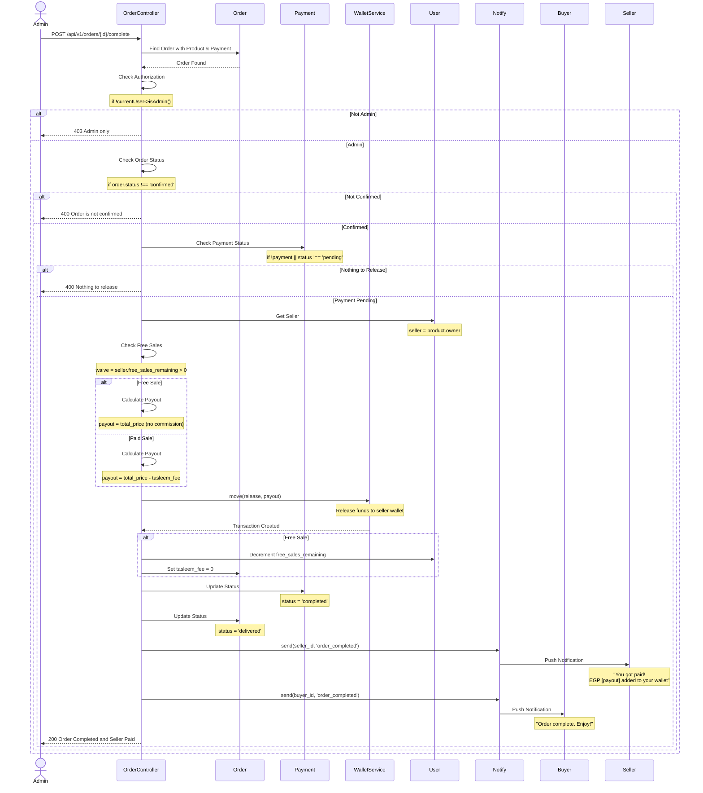

# Scenario 4: Complete Order & Release Funds

```mermaid
sequenceDiagram
    actor Admin
    participant OrderController
    participant Order
    participant Payment
    participant WalletService
    participant User
    participant Notify
    participant Buyer
    participant Seller

    Admin->>OrderController: POST /api/v1/orders/{id}/complete

    OrderController->>Order: Find Order with Product & Payment
    Order-->>OrderController: Order Found

    OrderController->>OrderController: Check Authorization
    Note over OrderController: if !currentUser->isAdmin()

    alt Not Admin
        OrderController-->>Admin: 403 Admin only
    else Admin
        OrderController->>OrderController: Check Order Status
        Note over OrderController: if order.status !== 'confirmed'

        alt Not Confirmed
            OrderController-->>Admin: 400 Order is not confirmed
        else Confirmed
            OrderController->>Payment: Check Payment Status
            Note over Payment: if !payment || status !== 'pending'

            alt Nothing to Release
                OrderController-->>Admin: 400 Nothing to release
            else Payment Pending
                OrderController->>User: Get Seller
                Note over User: seller = product.owner

                OrderController->>OrderController: Check Free Sales
                Note over OrderController: waive = seller.free_sales_remaining > 0

                alt Free Sale
                    OrderController->>OrderController: Calculate Payout
                    Note over OrderController: payout = total_price (no commission)
                else Paid Sale
                    OrderController->>OrderController: Calculate Payout
                    Note over OrderController: payout = total_price - tasleem_fee
                end

                OrderController->>WalletService: move(release, payout)
                Note over WalletService: Release funds to seller wallet
                WalletService-->>OrderController: Transaction Created

                alt Free Sale
                    OrderController->>User: Decrement free_sales_remaining
                    OrderController->>Order: Set tasleem_fee = 0
                end

                OrderController->>Payment: Update Status
                Note over Payment: status = 'completed'

                OrderController->>Order: Update Status
                Note over Order: status = 'delivered'

                OrderController->>Notify: send(seller_id, 'order_completed')
                Notify->>Seller: Push Notification
                Note over Seller: "You got paid!<br/>EGP [payout] added to your wallet"

                OrderController->>Notify: send(buyer_id, 'order_completed')
                Notify->>Buyer: Push Notification
                Note over Buyer: "Order complete. Enjoy!"

                OrderController-->>Admin: 200 Order Completed and Seller Paid
            end
        end
    end
```