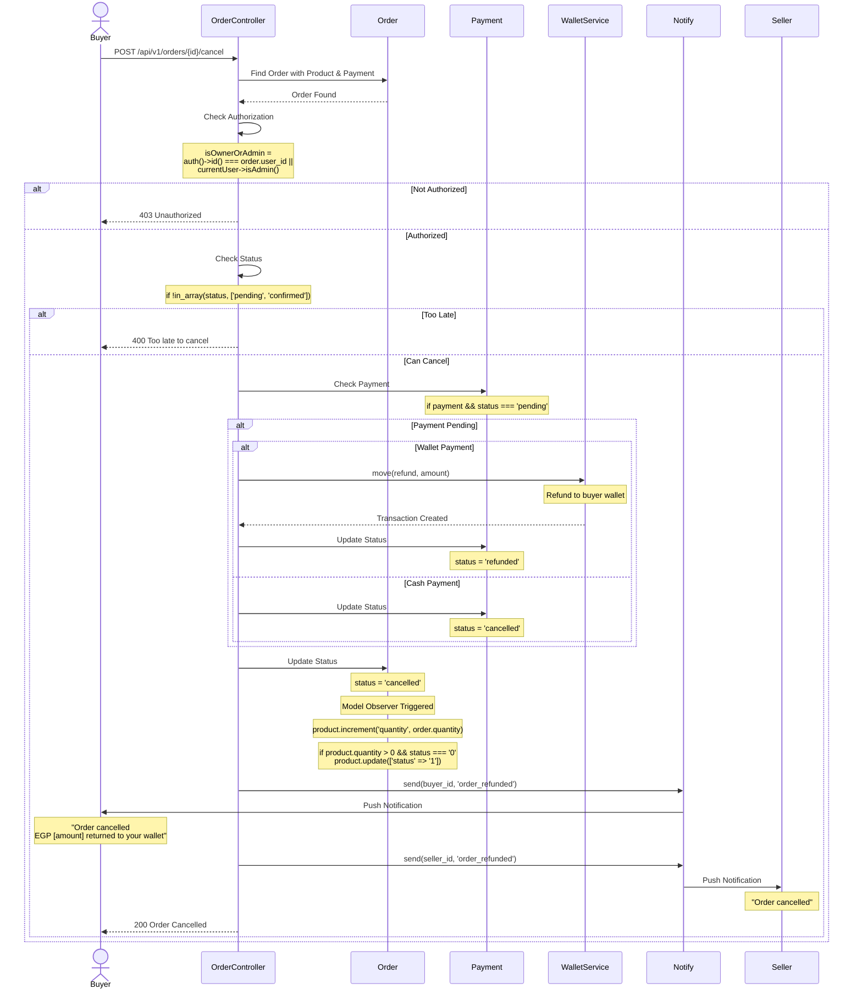

# Scenario 5: Cancel Order & Refund

```mermaid
sequenceDiagram
    actor Buyer
    participant OrderController
    participant Order
    participant Payment
    participant WalletService
    participant Notify
    participant Seller

    Buyer->>OrderController: POST /api/v1/orders/{id}/cancel

    OrderController->>Order: Find Order with Product & Payment
    Order-->>OrderController: Order Found

    OrderController->>OrderController: Check Authorization
    Note over OrderController: isOwnerOrAdmin =<br/>auth()->id() === order.user_id ||<br/>currentUser->isAdmin()

    alt Not Authorized
        OrderController-->>Buyer: 403 Unauthorized
    else Authorized
        OrderController->>OrderController: Check Status
        Note over OrderController: if !in_array(status, ['pending', 'confirmed'])

        alt Too Late
            OrderController-->>Buyer: 400 Too late to cancel
        else Can Cancel
            OrderController->>Payment: Check Payment
            Note over Payment: if payment && status === 'pending'

            alt Payment Pending
                alt Wallet Payment
                    OrderController->>WalletService: move(refund, amount)
                    Note over WalletService: Refund to buyer wallet
                    WalletService-->>OrderController: Transaction Created

                    OrderController->>Payment: Update Status
                    Note over Payment: status = 'refunded'
                else Cash Payment
                    OrderController->>Payment: Update Status
                    Note over Payment: status = 'cancelled'
                end
            end

            OrderController->>Order: Update Status
            Note over Order: status = 'cancelled'

            Note over Order: Model Observer Triggered
            Note over Order: product.increment('quantity', order.quantity)
            Note over Order: if product.quantity > 0 && status === '0'<br/>product.update(['status' => '1'])

            OrderController->>Notify: send(buyer_id, 'order_refunded')
            Notify->>Buyer: Push Notification
            Note over Buyer: "Order cancelled<br/>EGP [amount] returned to your wallet"

            OrderController->>Notify: send(seller_id, 'order_refunded')
            Notify->>Seller: Push Notification
            Note over Seller: "Order cancelled"

            OrderController-->>Buyer: 200 Order Cancelled
        end
    end
```