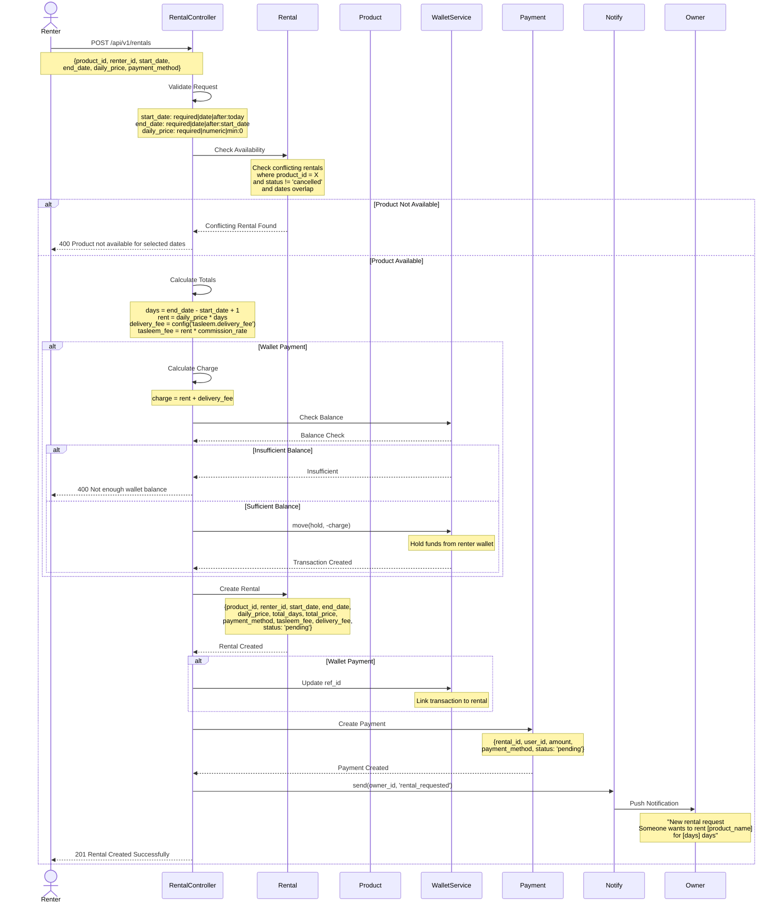

# Scenario 6: Create Rental with Availability Check

```mermaid
sequenceDiagram
    actor Renter
    participant RentalController
    participant Rental
    participant Product
    participant WalletService
    participant Payment
    participant Notify
    participant Owner

    Renter->>RentalController: POST /api/v1/rentals
    Note over Renter,RentalController: {product_id, renter_id, start_date,<br/>end_date, daily_price, payment_method}

    RentalController->>RentalController: Validate Request
    Note over RentalController: start_date: required|date|after:today<br/>end_date: required|date|after:start_date<br/>daily_price: required|numeric|min:0

    RentalController->>Rental: Check Availability
    Note over Rental: Check conflicting rentals<br/>where product_id = X<br/>and status != 'cancelled'<br/>and dates overlap

    alt Product Not Available
        Rental-->>RentalController: Conflicting Rental Found
        RentalController-->>Renter: 400 Product not available for selected dates
    else Product Available
        RentalController->>RentalController: Calculate Totals
        Note over RentalController: days = end_date - start_date + 1<br/>rent = daily_price * days<br/>delivery_fee = config('tasleem.delivery_fee')<br/>tasleem_fee = rent * commission_rate

        alt Wallet Payment
            RentalController->>RentalController: Calculate Charge
            Note over RentalController: charge = rent + delivery_fee

            RentalController->>WalletService: Check Balance
            WalletService-->>RentalController: Balance Check

            alt Insufficient Balance
                WalletService-->>RentalController: Insufficient
                RentalController-->>Renter: 400 Not enough wallet balance
            else Sufficient Balance
                RentalController->>WalletService: move(hold, -charge)
                Note over WalletService: Hold funds from renter wallet
                WalletService-->>RentalController: Transaction Created
            end
        end

        RentalController->>Rental: Create Rental
        Note over Rental: {product_id, renter_id, start_date, end_date,<br/>daily_price, total_days, total_price,<br/>payment_method, tasleem_fee, delivery_fee,<br/>status: 'pending'}
        Rental-->>RentalController: Rental Created

        alt Wallet Payment
            RentalController->>WalletService: Update ref_id
            Note over WalletService: Link transaction to rental
        end

        RentalController->>Payment: Create Payment
        Note over Payment: {rental_id, user_id, amount,<br/>payment_method, status: 'pending'}
        Payment-->>RentalController: Payment Created

        RentalController->>Notify: send(owner_id, 'rental_requested')
        Notify->>Owner: Push Notification
        Note over Owner: "New rental request<br/>Someone wants to rent [product_name]<br/>for [days] days"

        RentalController-->>Renter: 201 Rental Created Successfully
    end
```