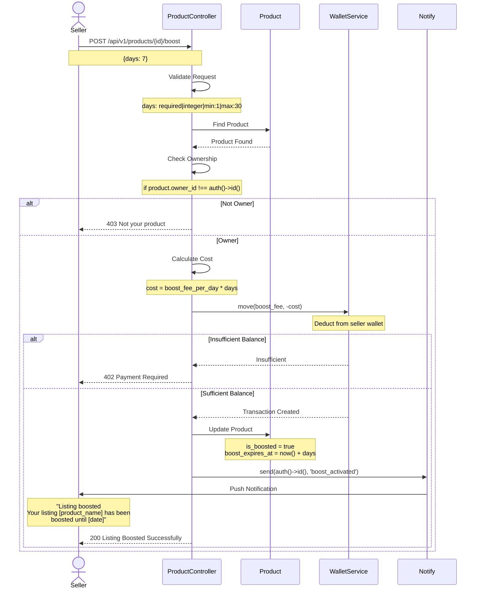

# Scenario 7: Boost Product with Wallet Deduction

```mermaid
sequenceDiagram
    actor Seller
    participant ProductController
    participant Product
    participant WalletService
    participant Notify

    Seller->>ProductController: POST /api/v1/products/{id}/boost
    Note over Seller,ProductController: {days: 7}

    ProductController->>ProductController: Validate Request
    Note over ProductController: days: required|integer|min:1|max:30

    ProductController->>Product: Find Product
    Product-->>ProductController: Product Found

    ProductController->>ProductController: Check Ownership
    Note over ProductController: if product.owner_id !== auth()->id()

    alt Not Owner
        ProductController-->>Seller: 403 Not your product
    else Owner
        ProductController->>ProductController: Calculate Cost
        Note over ProductController: cost = boost_fee_per_day * days

        ProductController->>WalletService: move(boost_fee, -cost)
        Note over WalletService: Deduct from seller wallet

        alt Insufficient Balance
            WalletService-->>ProductController: Insufficient
            ProductController-->>Seller: 402 Payment Required
        else Sufficient Balance
            WalletService-->>ProductController: Transaction Created

            ProductController->>Product: Update Product
            Note over Product: is_boosted = true<br/>boost_expires_at = now() + days

            ProductController->>Notify: send(auth()->id(), 'boost_activated')
            Notify->>Seller: Push Notification
            Note over Seller: "Listing boosted<br/>Your listing [product_name] has been<br/>boosted until [date]"

            ProductController-->>Seller: 200 Listing Boosted Successfully
        end
    end
```
