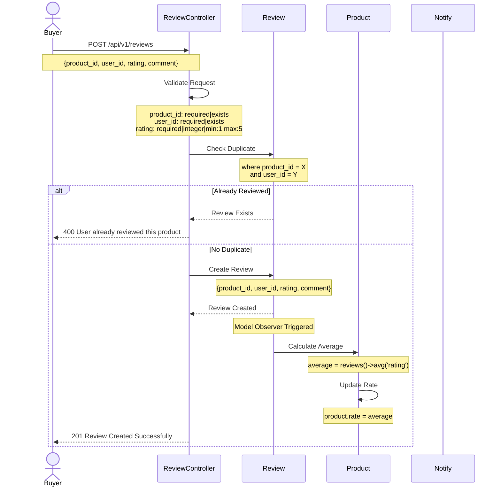

# Scenario 8: Create Review with Auto Rating Update

```mermaid
sequenceDiagram
    actor Buyer
    participant ReviewController
    participant Review
    participant Product
    participant Notify

    Buyer->>ReviewController: POST /api/v1/reviews
    Note over Buyer,ReviewController: {product_id, user_id, rating, comment}

    ReviewController->>ReviewController: Validate Request
    Note over ReviewController: product_id: required|exists<br/>user_id: required|exists<br/>rating: required|integer|min:1|max:5

    ReviewController->>Review: Check Duplicate
    Note over Review: where product_id = X<br/>and user_id = Y

    alt Already Reviewed
        Review-->>ReviewController: Review Exists
        ReviewController-->>Buyer: 400 User already reviewed this product
    else No Duplicate
        ReviewController->>Review: Create Review
        Note over Review: {product_id, user_id, rating, comment}
        Review-->>ReviewController: Review Created

        Note over Review: Model Observer Triggered
        Review->>Product: Calculate Average
        Note over Product: average = reviews()->avg('rating')
        Product->>Product: Update Rate
        Note over Product: product.rate = average

        ReviewController-->>Buyer: 201 Review Created Successfully
    end
```